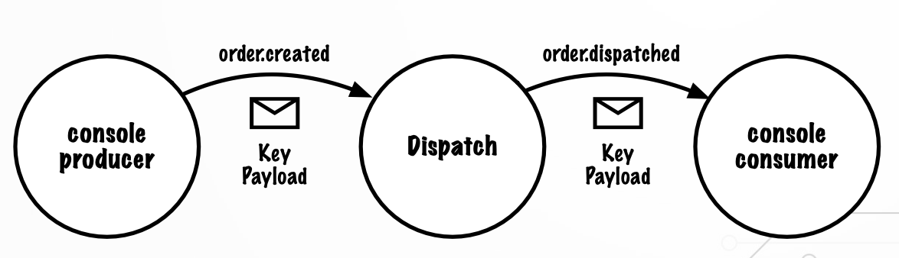
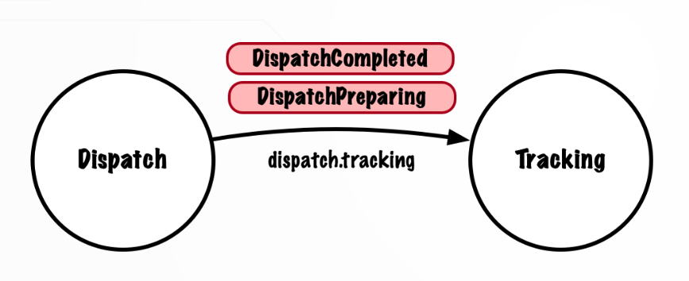

# INTRODUCTION TO KAFKA WITH SPRING BOOTS

Curso Udemy de Kafka con Spring Boot.

## Wiki & FAQ

`https://github.com/lydtechconsulting/introduction-to-kafka-with-spring-boot/wiki`

## Instalar Kafka localmente y ejecutar el Broker

- Instalar Apache Kafka
  - En Mac
    - `https://kafka.apache.org/downloads`
    - Yo estoy utilizando la imagen Docker (para el server) para mi Raspberry Pi y he usado esta documentación:
      - De aquí cogí el `docker-compose.yml`: `https://medium.com/towards-data-engineering/unlock-the-power-of-apache-kafka-with-the-official-docker-image-5a65192e618b`
        - En `01-Docker-Compose` tengo también ese archivo y como ejecutar
      - De aquí cogí distintos mandatos: `https://hub.docker.com/r/apache/kafka`
      - Aquí indica como hacer que funcione en la LAN en distintos ordenadores y la WAN: `https://stackoverflow.com/questions/61101236/accessing-kafka-broker-from-outside-my-lan`
      - En la Raspberry Pi tuve que instalar Java
      - En la Raspberry Pi tuve también que instalar una versión de Kafka, para pruebas, siguiendo esta documentación:
        - Esta es la versión de Kafka (es más que posible que ya haya cambiado) que me descargué: `https://www.apache.org/dyn/closer.cgi?path=/kafka/3.9.0/kafka_2.13-3.9.0.tgz`
        - En la Raspberry Pi lo instalé en el directorio `~/tools/kafka` con el mandato: `tar -xzf kafka_2.13-3.9.0.tgz`
  - En Windows
    - No voy a hacerlo en Windows, pero dejo documentación
    - `https://github.com/lydtechconsulting/introduction-to-kafka-with-spring-boot/wiki/Installing-and-Running-Kafka-on-Windows`
    - `https://learn.microsoft.com/en-us/windows/wsl/install`

## Sending and Receiving

Vamos a enviar y recibir mensajes.

Para ello, utilizaremos un par de utilidades de línea de comandos suministradas por Kafka, una para publicar mensajes en un topic y otra para consumir mensajes de un topic.

Iniciamos tres terminales, una para el servidor Kafka, otra para el Consumer y otra para el Producer.

Esto lo hice en la Raspberry Pi, donde me dirigí a la carpeta `/home/pi/tools/kafka/kafka_2.13-3.9.0/bin` donde instalé la versión local de Kafka.

- Crear el topic en los contenedores Docker de Kafka. Estos contenedores de Kafka son el server. Esto solo hay que hacerlo una vez
  - `./kafka-topics.sh --bootstrap-server localhost:29092,localhost:39092,localhost:49092 --create --topic test-topic`
  - Para ver si se ha creado el topic, desde la versión local de Kafka ejecutar: `./kafka-topics.sh --list --bootstrap-server localhost:29092`
    - Tiene que salir el nombre `test-topic`
  - Para ver el mismo resultado desde Docker, ejecutar
    - Entrar al contenedor: `docker exec --workdir /opt/kafka/bin/ -it kafka-1 sh`
    - Ver el topic: `./kafka-topics.sh --list --bootstrap-server kafka-1:19092`
    - Tiene que salir el nombre `test-topic`
- Ejecutar la parte consumer en la terminal en el directorio donde tengo instalada la versión local de Kafka. Lo iniciamos para escuchar mensajes que pueden llegar sobre el topic
  - `./kafka-console-consumer.sh --bootstrap-server localhost:29092,localhost:39092,localhost:49092 --topic test-topic --from-beginning`
- Ejecuta la parte producer en otra terminal, en el directorio donde tengo instalada la versión local de Kafka. Importante indicar siempre el mismo nombre de topic
  - `./kafka-console-producer.sh --bootstrap-server localhost:29092,localhost:39092,localhost:49092 --topic test-topic`
  - Ahora, aquí en el producer, podemos escribir los mensajes que queramos, por ejemplo `my first message`
  - Esto debe aparecer en la terminal del consumer

Si ejecutamos en una nueva terminal de la Raspberry Pi el comando `docker container logs -f kafka-1` veremos los logs del contenedor que tiene el servidor Kafka. Ahí aparece cuando se crea un topic, cuando se modifica, cuando se cierra el consumer....

Para terminar, tanto en la terminal del consumer como en la terminal del producer como en la terminal con los logs del server, pulsar `Ctrl+C`.

IMPORTANTE: En la Raspberry Pi, en la carpeta `~./docker/kafka` tengo el fichero `docker-compose.yml` y el fichero `Ejecucion.txt` con más o menos la misma explicación que tengo aquí.

## CLI Tools

En la parte de envío y recibo de mensajes ya hemos visto varios usos de herramientas de CLI. Aquí se oficializa como se usa el CLI.

Las herramientas de CLI se encuentran en el directorio de instalación de Kafka, en el subdirectorio `bin`.

En mi Raspberry Pi, están en `/home/pi/tools/kafka/kafka_2.13-3.9.0/bin`.

Para ver cómo funcionan los distintos comandos de CLI y qué opciones tenemos, ejecutar desde ese directorio bin: `./<comando> --help`

### Arrancar y Parar el servidor Kafka

Como lo tengo en mi Raspberry Pi, en Docker, arrancando los contenedores automáticamente se arranca el server y parándolos se paran.

De todas formas, los comandos son, estando en la carpeta bin:

- Arrancar indicando la configuración
  - `./kafka-server-start.sh ../config/kraft/server.properties`
- Parar
  - `./kafka-server-stop.sh`

Estos comandos hay que ejecutarlos dentro del contenedor. Para entrar al contenedor kafka-1 ejecutar: `docker exec --workdir /opt/kafka/bin/ -it kafka-1 sh`.

### Topic Tool

El Topic tool puede usarse para listar todos los topics existentes, crear uno nuevo, modificar uno existente, eliminarlo y ver sus detalles.

- El comando para listar es, desde el directorio bin de mi instalación local de la Raspberry Pi:
  - `./kafka-topics.sh --bootstrap-server localhost:29092 --list`
  - Donde `29092` es el puerto del Kafka server que tengo corriendo en el contenedor Docker (uno de los tres que tengo) y `--list` es lo que quiero hacer con el topic, que es listarlo en este ejemplo.
- Para crear un nuevo topic, ejecutar:
  - `./kafka-topics.sh --bootstrap-server localhost:29092,localhost:39092,localhost:49092 --create --topic my.new.topic`
  - El nombre del topic se puede separar por puntos. Esto es muy común, pero indicar que Kafka trata el punto y el guión bajo como el mismo carácter
  - Los crea en mis contenedores Docker, que es el server de Kafka
- Para obtener más información de un topic, ejecutar:
  - `./kafka-topics.sh --bootstrap-server localhost:29092 --describe --topic my.new.topic`
- Cambiar el número de particiones que tiene un topic
  - `./kafka-topics.sh --bootstrap-server localhost:29092 --alter --topic my.new.topic --partitions 3`
- Eliminar el nuevo topic creado
  - `./kafka-topics.sh --bootstrap-server localhost:29092,localhost:39092,localhost:49092 --delete --topic my.new.topic`

### Consumer Group Tool

Es una colección de consumers que trabajan juntos consumiendo mensajes desde las particiones de un topic.

Para hacer un ejemplo de un grupo de consumers, necesitamos un topic con múltiples particiones.

- Creamos el topic `cg.demo.topic` con 5 particiones
  - `./kafka-topics.sh --bootstrap-server localhost:29092,localhost:39092,localhost:49092 --create --topic cg.demo.topic --partitions 5`
- Confirmamos que se ha creado correctamente en uno de los servers
  - `./kafka-topics.sh --bootstrap-server localhost:29092 --describe --topic cg.demo.topic`
- Los grupos de consumidores se crean automáticamente cuando un consumer se conecta a un topic o una partición
  - Se debe indicar el nombre del grupo de consumer al que queremos asociar ese consumer
  - Si no especificamos ningún grupo se asigna al por defecto
  - `./kafka-console-consumer.sh --bootstrap-server localhost:29092,localhost:39092,localhost:49092 --topic cg.demo.topic --group my.new.group`
- Ahora listamos en otra terminal la lista de grupos de consumers
  - `./kafka-consumer-groups.sh --bootstrap-server localhost:29092 --list`
- Obtenemos más información de nuestro grupo de consumers
  - `./kafka-consumer-groups.sh --bootstrap-server localhost:29092 --describe --group my.new.group`
- En otra terminal, arrancamos otro consumer
  - `./kafka-console-consumer.sh --bootstrap-server localhost:29092,localhost:39092,localhost:49092 --topic cg.demo.topic --group my.new.group`
- Ahora tenemos dos consumers en el mismo grupo y para el mismo topic
- Vemos como afecta esto al grupo de consumers
  - `./kafka-consumer-groups.sh --bootstrap-server localhost:29092 --describe --group my.new.group`
- En este ejemplo veo que el consumer1 aparece para las particiones 0, 1 y 2 y el consumer2 aparece para las particiones 3 y 4
  - Ocurre el proceso llamado rebalanceo
- Para obtener un estado de cada grupo de consumers
  - `./kafka-consumer-groups.sh --bootstrap-server localhost:29092 --describe --group my.new.group --state`
  - Se indica el número de miembros y el estado de salud, entre otras cosas
  - Importante para ver el estado de salud del grupo de consumers.
- Comprobar que consumers están en el grupo de consumers
  - `./kafka-consumer-groups.sh --bootstrap-server localhost:29092 --describe --group my.new.group --members`
- Para salir del grupo de consumers, en cada terminal donde tengo arrancado un consumer, pulsar `Ctrl+C`
- Para borrar un grupo de consumers
  - `./kafka-consumer-groups.sh --bootstrap-server localhost:29092,localhost:39092,localhost:49092 --delete --group my.new.group`
- Eliminamos el topic `cg.demo.topic`
  - `./kafka-topics.sh --bootstrap-server localhost:29092,localhost:39092,localhost:49092 --delete --topic cg.demo.topic`

## Coding Kafka with Spring Boot

El diseño de este sistema podría describirse como una arquitectura dirigida por eventos, que constaría de muchos microservicios independientes.

Cada uno de estos servicios puede consumir y/o producir múltiples tipos de eventos, accesos a BD relacionales o no relacionales...

El caso es que hay muchas posibilidades que se podrían estudiar, pero todo eso queda fuera del alcance del curso.

Nos centraremos en los elementos Kafka y Spring Boot de la implementación.

Vamos a tener un servicio de envío que reaccionará a las entradas y generará un evento cuando se envíe el pedido.

La comunicación entre producers y consumers se realiza a través de los topics en el broker. Este broker no se suele dibujar en los diagramas porque produce un ruido innecesario a la hora de entenderlos, pero la presencia del broker está implícita en los diagramas.

Un patrón útil para reducir la carga de un servicio en un sistema es dividir la actividad de consulta y transferirla a otro servicio (repeatable pattern).

Importante indicar que para este proyecto no se usa Zookeeper, ya deprecado, sino Kraft Cluster.

`dispatch`

Generamos el proyecto `dispatch` usando la web `https://start.spring.io/`, y usando como dependencias `Lombok` y `Spring for Apache Kafka`.

Documentación:

- `https://github.com/lydtechconsulting/introduction-to-kafka-with-spring-boot/wiki/Mockito`
- `https://www.lydtechconsulting.com/blog-kafka-json-serialization.html`


## Assignment - Tracking Service

Continuamos con el proyecto `dispatch` y vamos a añadirle un nuevo servicio llamado `Tracking`.

El service tracking determina el estado consumiendo events del topic `dispatch.tracking` y, a su vez, produce events que reflejan el estado actual de un dispatch.

```
           dispatch.tracking                   tracking.status
Dispatch ------------------------> Tracking ------------------------>
```


**CAMBIOS ESPERADOSs**

Todo el código y los pasos requeridos para crear y probar el nuevo servicio ha sido cubierto en los módulos precedentes.

**Dispatch Service**

`DispatchService` deberá emitir un event `DispatchPreparing` sobre un topic llamado `dispatch.tracking`.

El payload para el event `DispatchPreparing` debería ser parecido a:

`orderId: UUID`

**Tracking Service**

Crear un nuevo servicio llamado `TrackingService`. Seguir los mismos pasos usados para crear `DispatchService`.

`TrackingService` debe consumir events desde el topic `dispatch.tracking` y emitir en event `TrackingStatusUpdated` en un nuevo topic llamado `tracking.status`.

El payload para el event `TrackingStatusUpdated` debería parecerse a:

```
orderId: UUID
status: Status
```

El event debería contener solo un valor `'PREPARING'` en este momento.

**Testing**

Los cambios en ambos servicios deberían tener cobertura de unit tests.

`tracking`

Creamos un nuevo proyecto para Tracking.

También añadimos la parte arriba indicada de `DispatchService` al proyecto `dispatch`.

## Spring-Boot Integration Test

Documentación: `https://www.lydtechconsulting.com/blog-kafka-consume-produce-testing.html`

**¿Por qué necesitamos pruebas de integración?**

En nuestros proyectos `dispatch` y `tracking` ya tenemos `pruebas unitarias`, que son pequeñas, rápidas de ejecutar y fáciles de escribir.

Proporcionan información muy rápida sobre qué hacen las unidades individuales de código, y qué esperamos usando mocking para las llamadas a otras unidades de código y recursos externos. Podemos probar las distintas ramas de decisión y la gestión de errores dentro de nuestras unidades de código.

Todo esto es necesario, pero los tests unitarios solo prueban unidades de código.

Seguimos sin saber si estas unidades de código funcionan entre sí de la forma que deseamos.

Aquí es donde entran en juego las `pruebas de integración`.

Las pruebas de integración nos permiten verificar que las unidades individuales de código funcionan correctamente juntas.

Podemos probar los flujos de procesamiento y afirmar que, para unas entradas dadas, obtenemos las salidas y efectos deseados.

Una prueba de integración cargará el contexto de la aplicación e instanciará todos nuestros beans igual que cuando la aplicación se despliega en el entorno de producción.

Podemos usar instancias en memoria de recursos externos como bases de datos y message brokers para probar que estamos manejando correctamente las respuestas de esos recursos externos. Y, al utilizar las intancias en memoria de los recursos externos, podemos ejecutar las pruebas de integración en el pipeline sin tener que levantar ninguna otra infraestructura. Incluso podemos ejecutarlos localmente para obtener información muy rápidamente.

**Qué vamos a hacer**

En particular con nuestro curso de Kafka, las pruebas unitarias no ejercitan la integración con el propio broker de Kafka. Nuestra prueba implementará un producer de prueba que utiliza una instancia de KafkaTemplate para enviar un event al topic `order.created` que será consumido por la aplicación.

Definiremos también tests de consumer que recibirán los events emitidos por la aplicación. Esto es, el event sobre el topic `order.dispatched` y el event sobre el topic `dispatch.tracking`. Podremos afirmar entonces que se han recibido los events esperados.

Indicar que con estas pruebas ya no será necesario iniciar una instancia real de Kafka instalada en nuestro ordenador local.

## Multiple Instances & Consumer Group

Ver la siguiente documentación: `https://www.lydtechconsulting.com/blog-kafka-rebalance-part1.html`

Los consumer groups nos permiten gestionar múltiples instancias y facilitar el procesamiento paralelo. Durante este módulo vamos a ver:

- Throughput (rendimiento)
- Fault Tolerance
  - Los consumer groups garantizan la continuidad de la actividad cuando se producen fallos en el sistema
- Scaling
  - Permite manipular cargas mayores con facilidad
- Heartbeating
  - Mecanismo para garantizar la continuidad del servicio
- Rebalancing
  - El broker redistribuye las particiones asociadas al consumer perdido entre los consumers activos
  - Si el consumer perdido vuelve a estar activo, se vuelve a rebalancear

Es muy importante indicar que, falle lo que falle, no se pierde ningún evento. El log continua grabando eventos, pero el offset (desplazamiento) no cambia.

**¿Qué nos aportan los consumer groups?**

- Isolation or Parallelism
- Distinct Processing Logic
- Throughput
- Fault Tolerance

El consumer puede formar parte de un grupo y procesr eventos en paralelo. O, el consumer puede trabajar aislado y leer su propio flujo de datos.

La diferencia entre establecer un consumer como parte de un grupo o independiente se consigue estableciendo la propiedad groupId.

Hay varias razones por las que podemos querer que más de un consumer lea el mismo flujo de datos. Las principales son el rendimiento y la tolerancia a fallos.

Y a veces también hay buenas razones para no mostrar un flujo de datos.

Por tanto, vamos a mirar distintos procesamientos lógicos en el que el servicio específico puede no necesitar rendimiento y tolerancia a fallos.

Los consumer groups y la tolerancia de fallos van de la mano, ya que permiten a otros consumers compartir la carga en caso de fallo del servicio.

Un fallo del servicio provocará un rebalanceo de la carga, y este rebalanceo se desencadena por una ruptura de la comunicación entre el consumer y el broker, debido a un fallo de Heartbeat o que el consumer ha superado el polling interval.

Aunque el rebalanceo es estupendo, tiene el coste de detener el procesamiento de los topic partitions. Su impacto varía en función de la estrategia de rebalanceo elegida.

Por tanto, el rebalanceo tiene la capacidad de mantener el sistema en funcionamiento, pero su uso excesivo también puede afectar gravemente el rendimiento del sistema.

**Ejercicios con Consumer Groups**

A partir de nuestro proyecto `dispatch` vamos a generar un nuevo proyecto para estos ejercicios.

Vamos a comparar y constrastar el comportamiento del consumer en función de los consumer groups a los que pertenece.

En cada caso, ejecutaremos dos instancias de nuestras aplicaciones Spring Boot, para tener dos instancias consumidoras separadas ejecutándose.

En el `primer ejercicio`, demostraremos el uso de un consumer group compartido con ambas instancias (Shared Consumer Group) pertenecientes al mismo grupo. Solo un consumer recibirá mensajes del topic partition order.created

En el `segundo ejercicio`, demostraremos la conmutación por error del consumidor (Consumer Failover) Detendremos la instancia del consumer que tiene asignada la topic partition y observaremos como se reasigna la partición al segundo consumer. Este segundo consumer recibirá los mensajes order.created

En el `tercer ejercicio`, mostraremos que las dos instancias consumers pertenecerán a consumer groups distintos, y observaremos cómo ambas instancias consumen el mensaje del topic partition order.created (Duplicate Consumption)

**Primer Ejercicio: Consumer Group Compartido**

Creamos el proyecto `dispatch-shared-consumer-group`.

Ejecutaremos dos instancias de la aplicación `dispatch-shared-consumer-group`.

La aplicación se actualizará para generar un ID de aplicación único al iniciarse. Cada instancia tendrá un ID único y lo añadiremos al evento de salida order.dispatched, para que podamos ver desde qué instancia se consumió el event order.created y se produjo el event order.dispatched.

Como cada aplicación tiene un consumer definido escuchando el topic order.created, en el método handler, anotación @KafkaListener, especificando el consumer group `dispatch.order.created.consumer`, ambas instancias se iniciarán en el mismo grupo de consumers.

El topic tiene una sola partition y se asignará una única instancia de consumidor de aplicaciones. Por lo tanto, solo una instancia de consumer consumirá el event y solo veremos un event de order.dispatched.

Utilizaremos una terminal como producer y otra como consumer para demostrar este comportamiento.

**Segundo Ejercicio: Consumer Failover**

Ejercicio realizado sobre el proyecto `dispatch-shared-consumer-group`.

Examinaremos el comportamiento de los consumers en caso de fallo. Con nuestras dos instancias de aplicación en ejecución y la primera instancia asignada al topic partition `order.created`, demostraremos el comportamiento de `Failover`, matando a esta primera instancia.

A medida que el consumer abandona el consumer group, se dispara el rebalanceo del consumer group. A todos los consumers del grupo se les revocan sus topic partition asignadas y luego se reasignan. En este caso, el topic partition irá a la segunda instancia del consumer de aplicaciones.

**Tercer Ejercicio: Duplicate Consumption**

Ejecutaremos dos instancias de la aplicación `dispatch-shared-consumer-group`, pero esta vez asignaremos diferentes IDs de consumer group a cada instancia.

Luego demostraremos que ambas instancias consumers recibirán el evento que enviemos usando la terminal del producer.

Ambos consumers en sus respectivos consumer group se suscriben al topic `order.created` y, por lo tanto, reciben este event, lo procesan y ambos envían events de salida, incluyendo el event `order.dispatched`.

Por tanto, en la terminal del consumer se recibirán dos events de `order.dispatched` aunque solo hayamos enviado un único event `order.created`.

## Keys and Partitions

Ver la siguiente documentación: `https://www.lydtechconsulting.com/blog-kafka-message-keys.html`

Vamos a ver ordenación de eventos.

Tanto las claves como las particiones desempeñan un papel fundamental para que los events se procesen en orden.

La ordenación se puede conseguir con relativamente poco esfuerzo utilizando los fundamentos de Spring y Apache Kafka.

Vamos a ver:

- ¿Qué es ordering?
- Volvemos sobre las partitions
- ¿Qué perturba el ordering?
- Como garantizar el ordering cuando lo necesitamos obligatoriamente
- Keys

Ordering es poner en el orden correcto la secuencia en que ocurrieron los hechos.

Imaginando que ocurran tres events, uno de creación, otro de actualización y otro de eliminación, estos eventos deben procesarse en ese orden, ya que de lo contrario el resultado podría comprometer la integridad de los datos del sistema.

Indicar que muchas de las veces no es necesario ordenar los events, esto es algo que tenemos que estudiar a la hora de diseñar la solución.

Volvemos a las particiones, porque es aquí como se manifiesta realmente este problema.

Los mensajes se envían a través de topics, y un topic se compone al menos de una partition. El número de partitions que tiene cada topic se determina cuando se crea el topic, pero lo normal es que un topic tenga más de una partition.

Las partitions contribuyen al rendimiento y la escalabilidad. Más partitions equivalen a más escalabilidad, pero hay un coste asociado a tener más partitions, que es más sobrecarga. Conviene elegir el número con cuidado y basarse en los requisitos de rendimiento esperados.

Conviene recordar que, `cuando un event se escribe en un topic, en realidad se escribe en una partition de ese topic, y cada partition tendrá exactamente un consumer por consumer group`.

Más particiones --> Más consumers --> Más rendimiento --> Más sobrecarga

Sobre qué perturba el ordering, indicar que este puede fallar cuando los events se procesan a ritmos diferentes. Un event puede adelantarse a otro y, por tanto, perder su lugar en la secuencia mientras está en el topic.

Por ejemplo, si un topic consta de tres partitions y tenemos tres events A, B y C que se tienen que procesar en ese orden, si cada event va a una partition diferente de ese topic, y si además tenemos varios consumers, entonces no tenemos control sobre el orden de procesamiento. Estamos completamente a merced de los consumers.

Este problema se debe a que los events se han situado en partitions diferentes y, para solucionarlo, tenemos que tener todos los events relacionados en la misma partition. Así podemos evitar que los events se superpongan unos a otros, ya que una partition tiene exactamente un consumer (o ninguno)

¿Cómo mantener los events relacionados en la misma partition? Utilizando una message key.

La message key se utiliza para determinar en qué partition debe escribirse un mensaje.

Cada mensaje escrito en Kafka puede incluir opcionalmente una message key. Esta key agrupa mensajes relacionados y debe ser lo más simple posible, como un ID de usuario o un ID de pedido...

No es que una key más compleja cause problemas a Kafka, pero hará que el sistema sea más difícil de entender.

El producer de Kafka calcula una hash key y determina en qué partition debe escribirse el mensaje. Todos los mensajes con la misma key se colocarán en la misma partition.

**Proyecto ejemplo**

Creamos el proyecto `dispatch-ordering` al que se le pasa una message key al handler.

Para ello utilizaremos la anotación de Spring Kafka `@Header` y, en concreto usaremos `KafkaHeaders.RECEIVED_KEY`. Kafka extraerá la key del mensaje y la pasará al handler por nosotros.

Haremos lo mismo con `KafkaHeaders.RECEIVED_PARTITION`. Esto nos permitirá registrar la partition en la que se recibe cada event para verificar que los mensajes con la misma key se reciben en la misma partition.



**Consuming Keyed Messages**

Demostraremos que los mensajes producidos con la misma key serán escritos a, y consumidos desde la misma partition.

La aplicación `dispatch-ordering` espera que la key se incluya en las cabeceras de los mensajes del event `order.created`. Y añade esta key a los headers de los mensajes que emite.

Actualizaremos nuestra consola del producer para incluir una key y del mismo modo se actualizará la consola del consumer para imprimir la key que recibe de los headers de los mensajes.

Para demostrar el impacto de incluir una message key, actualizaremos el número de partitions en el topic `order.created` usando la herramienta `kafka-topics` de la línea de comandos.

A continuación, enviaremos varios mensajes con una mezcla de la misma key y diferentes keys y observaremos como los mensajes producidos con la misma key se escriben siempre en la misma partition y, por lo tanto, son consumidos por la misma instancia consumer de esa partition, garantizando que los mensajes se leen y se procesan en orden.

## Consuming Multiple Event Types

Ver siguiente artículo: `https://www.lydtechconsulting.com/blog-kafka-fat-pipe-thin-pipe.html`

Creamos la aplicación `tracking-multiple-event-types`.

Esta sección trata sobre el consumo de múltiples tipos de events del mismo topic.

Vamos a actualizar la configuración del service tracking para que esté preparado y pueda recibir events de distintos tipos para el mismo topic. En concreto vamos a recibir el nuevo event `DispatchCompleted`.



Para poder hacer esta actualización, moveremos la anotación `@KafkaListener` desde el nivel de método al nivel de clase. En el método usaremos la anotación `@KafkaHandler`. Esta anotación aparecerá para cada tipo de event que el consumer pueda recibir.

También tendremos que eliminar el tipo de deserialización por defecto, el de `DispatchPreparing`, que habíamos indicado en la clase de Configuración. A cambio, Spring Kafka se basará en el type header que se incluye por defecto en los mensajes de Kafka producidor por un producer de Spring, como es el caso de nuestro Dispatch Service Producer.

Spring Kafka utiliza el tipo por defecto para identificar qué paquetes son de confianza, es decir, pueden ser deserializados, y tenemos que indicar dichos paquetes.
