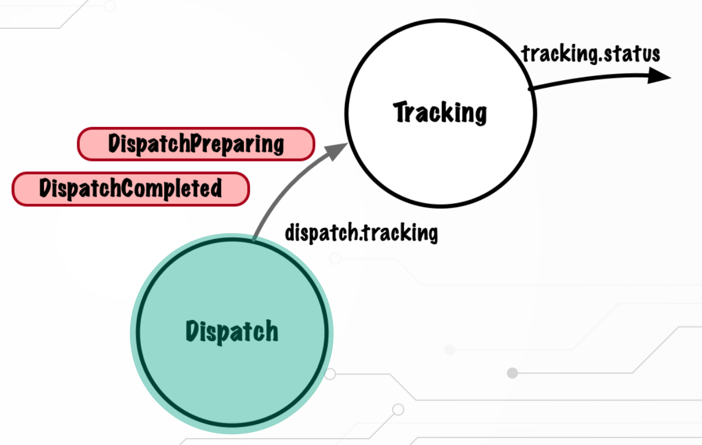

# dispatch-multiple-event-types

`DispatchService` se actualizará para generar un nuevo event que se enviará al topic existente, y el consumer de `TrackingService` se actualizará para consumir ambos tipos de events de este topic. `TrackingService` también se actualizará para generar un nuevo event `TrackingStatusUpdated`.



## Notas

1. Dispatch Service

Dispatch Service emite un nuevo `DispatchCompleted` event sobre el topic `dispatch.tracking`.

La data esperada del `DispatchCompleted` event es:

```
orderId: UUID
date: String
```

Notar que el único propósito del campo `date` es diferenciar el event `DispatchCompleted` del event `DispatchPreparing`.

2. Testing

Los cambios al service debe tener su correspondiente test unitario.

3. Integration Test

Recuerda que el test de integración de Dispatch Service actúa como un consumer del topic `dispatch.tracking`, así que también requerirá cambios para manejar varios events, similar a los implementados en el handler Tracking Service (proyecto Tracking-multiple-event-types)

En el Dispatch Service Integration test, el método `waitForAssignment` en el test de integración se tendrá que actualizar.

Ahora hay dos application listener containers, uno para la aplicación y otro para la prueba en sí, y debemos tener en cuenta que luego escuchamos una cantidad diferente de topics. El siguiente código muestra el cambio que debe realizar.

```
ContainerTestUtils.waitForAssignment(container,
container.getContainerProperties().getTopics().length * embeddedKafkaBroker.getPartitionsPerTopic()));
```

## Testing

- Clonar el repositorio
- Construcción y testing de la aplicación (esto cada vez que se haga cualquier cambio en la app)
  - `mvn clean install`

- Para ejecutar los proyectos y probar en real:
- Ejecutar una instancia de la aplicación `dispatch-multiple-event-types`, en una terminal a la que ponemos el nombre `dispatch`: `mvn spring-boot:run`
- Ejecutar una instancia de la aplicación `tracking-multiple-event-types`, en una terminal a la que ponemos el nombre `tracking`: `mvn spring-boot:run`

- Abriremos una terminal y le ponemos el nombre `consumer`. Vamos a la carpeta donde está la versión de Kafka que he instalado en el Mac
  - `~/Programacion/tools/kafka/kafka_2.13-3.9.0`
  - Ejecutar `bin/kafka-console-consumer.sh --bootstrap-server 192.168.1.41:29092,192.168.1.41:39092,192.168.1.41:49092 --topic tracking.status`

- Abriremos una terminal y le ponemos el nombre `producer`. Vamos a la carpeta donde está la versión de Kafka que he instalado en el Mac
  - `~/Programacion/tools/kafka/kafka_2.13-3.9.0`
  - Ejecutar `bin/kafka-console-producer.sh --topic order.created --bootstrap-server 192.168.1.41:29092,192.168.1.41:39092,192.168.1.41:49092 --property parse.key=true --property key.separator=:`
  - Introducimos una key que es un String seguido de un JSON de este tipo: `"123":{"orderId":"e12a1993-5d30-4d0a-b28e-d849f9bbe9c4", "item":"chair"}`

- En el consumer veremos lo siguiente:
- 
```
{"orderId":"e12a1993-5d30-4d0a-b28e-d849f9bbe9c4","status":"PREPARING"}
{"orderId":"e12a1993-5d30-4d0a-b28e-d849f9bbe9c4","status":"DISPATCHED"}
```

Correspondientes a los dos events `DispatchPreparing` y `DispatchCompleted`. 