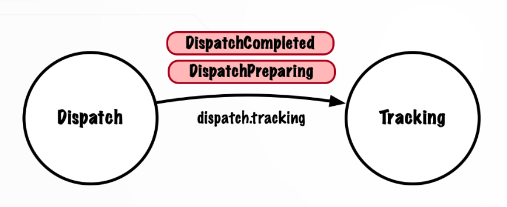

# tracking-multiple-type-events

Vamos a actualizar la configuración del service tracking para que esté preparado y pueda recibir events de distintos tipos para el mismo topic. En concreto vamos a recibir el nuevo event `DispatchCompleted`.

Para poder hacer esta actualización, moveremos la anotación `@KafkaListener` desde el nivel de método al nivel de clase. En el método usaremos la anotación `@KafkaHandler`. Esta anotación aparecerá para cada tipo de event que el consumer pueda recibir.

También tendremos que eliminar el tipo de deserialización por defecto, el de `DispatchPreparing`, que habíamos indicado en la clase de Configuración. A cambio, Spring Kafka se basará en el type header que se incluye por defecto en los mensajes de Kafka producidor por un producer de Spring, como es el caso de nuestro Dispatch Service Producer.

Spring Kafka utiliza el tipo por defecto para identificar qué paquetes son de confianza, es decir, pueden ser deserializados, y tenemos que indicar dichos paquetes.

## Notas

1. Kafka Handler

Modificamos el fuente `DispatchTrackingHandler`, llevándonos la anotación `@KafkaListener` a nivel de clase.

En el método `listen` añadimos la anotación `@KafkaHandler`.

Podemos crear varios métodos listen() anotados con `@KafkaHandler`. Estos pueden ser sobrecargados o nombrarse de manera diferente.

Si recibimos un mensaje de este topic con un encabezado de tipo que no coincide con un método anotado con @KafkaHandler (un event desconocido de este topic), se lanzará un ListenerExecutionFail Exception y continuará el polling del siguiente mensaje.

## Testing

- Clonar el repositorio
- Construcción y testing de la aplicación (esto cada vez que se haga cualquier cambio en la app)
  - `mvn clean install`